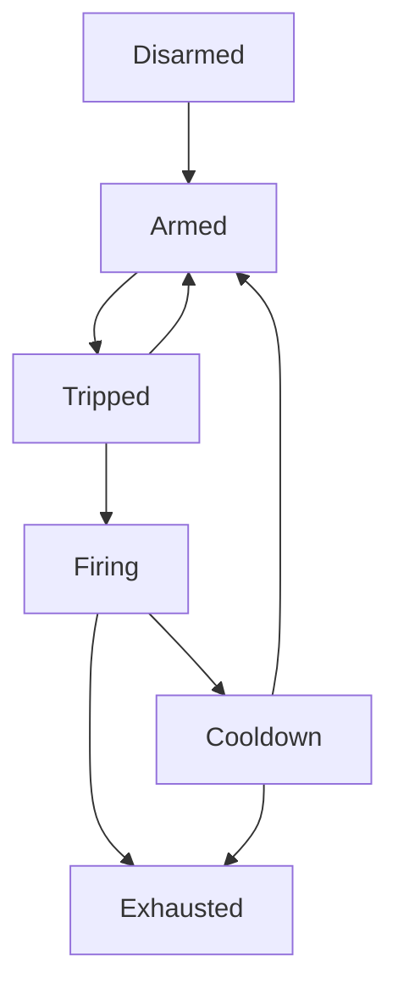

# Scripting Patterns

## Mutex

```
int mtx=0
when(...)[mtx+=1]
when(mtx==1)[ev]
ev::;
...do something
mtx=0;

```

Guards code to ensure it is only run once at a time, and drops all other
attempts to execute it. Replacing the last line with `((mtx>1))[mtx=1][mtx=1];`
will make the code trigger again if there was any attempt to trigger it during
execution.

# Creature Spawners

Randomly spawning monsters at arbitrary points throughout the level is likely
to cause gameplay that is Not Fun. Groundhog attempts to combat this by
dedicating _most_ of the scripting toward monster spawning. The goal is a
system that spawns monsters:

- Using the existing dungeon generation algorithm as much as possible.
- With special provisions for certain areas that allows some to be "safe" but
  others to be particularly dangerous.
- In defined "waves" of multiple monsters to deal with at once, between lulls
  where no monster spawns.
- Vaguely close to where the player is actually "playing" in the level.
- In a way that is not _quite_ predictable and seems somewhat random at first
  glance.
- Without creating too much overhead in terms of lines of script.

**Warning: Spoliers ahead!** If you are like me and just enjoy playing games
without trying to min/max them, read no further.

It is assumed that each plan has at most one spawner for each creature type.
There are many ways individual plan Architects can modify a creature spawner,
but the defaults are described here first.

## States

Each spawner follows the same basic state transition:



However, architects may override these by providing an `armEvent` or
`tripEvent` that explicitly moves the spawner into that state regardless what
state it is currently in.

It should be noted that each spawner uses an `arm` variable to track the
spawner state, but due to the somewhat frustrating nature of MMScript, the
states don't exactly line up with the theoretical state machine.

### Disarmed

An initial state where the spawner does nothing.

Moves to _armed_ state after an optional _initial delay_. For most spawners,
this occurs when the plan is discovered or on level start for pre-discovered
plans.

### Armed

The spawner is waiting for something to happen that _trips_ the spawner.

Monster spawners are usually tripped by miners entering the first outer pearl
layer of the plan, while Slug spawners are usually tripped by miners walking
over the Slimy Slug Holes.

Spawners can be configured to trip automatically on the first or every time
they reach the armed state.

### Tripped

The spawner has been activated and is deciding if it should spawn monsters.

There are various conditions that will "reject" the trip and move the spawner
back into the _armed_ state. These include:

- The anchor has placed a hold on monster spawns.
- Spawning this wave would put the number of hostiles over the
  _global hostiles cap_, if it exists.
- The air supply is running out and the spawner is configured to reject in
  this case.
- The player does not have enough crystals (depending on how the spawner is
  configured).
- The cavern is waiting for the _global hostiles cooldown_ to time out, if one
  is set.

If none of these reject conditions apply, the spawner moves to the _firing_
state.

### Firing

The spawner is actively spawning creatures - one at a time, with a short delay
between each. When the wave has finished spawning:

If the spawner has a _retrigger mode_, it moves to the _cooldown_ state.
Otherwise, it moves to the _exhausted_ state.

### Cooldown

The spawner is waiting.

If the spawner's _retrigger mode_ is _automatic_, the spawner moves back to the
_armed_ state at the end of the cooldown period.

If the spawner's _retrigger mode_ is _hoard_, the spawner will only become
_armed_ if a creature walked to the center of the plan (to eat a crystal).
Otherwise, it becomes _exhausted_.

### Exhausted

The spawner is done and will no longer fire.

## Options

See code comments for `CreatureSpawnerArgs` that explain additional settings.
