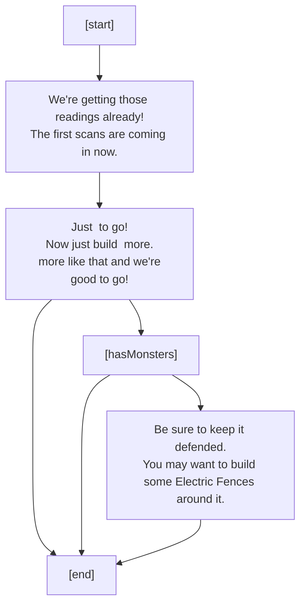
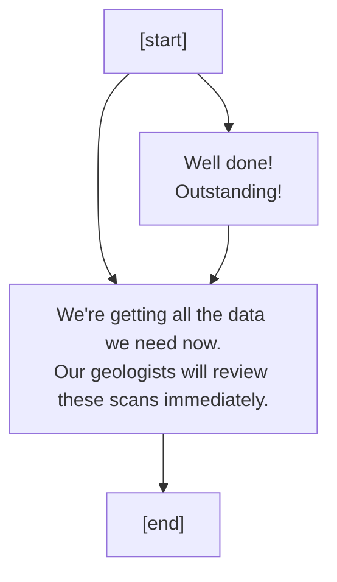
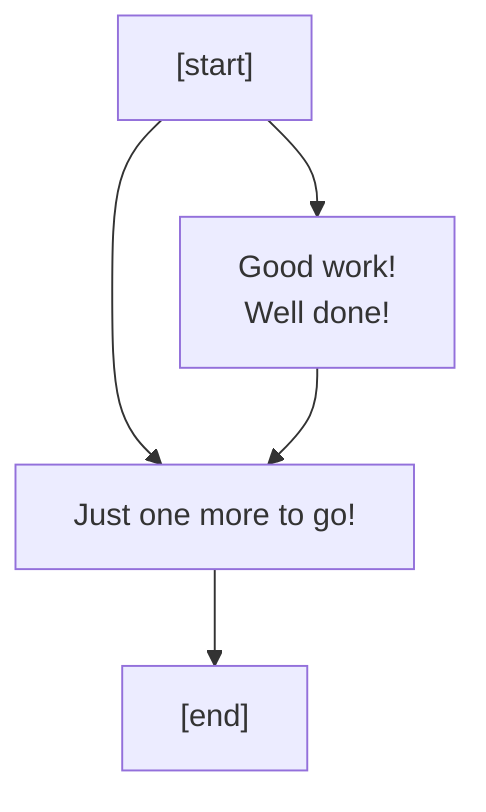
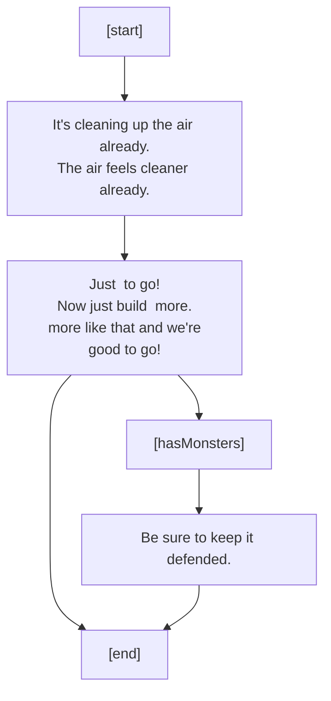
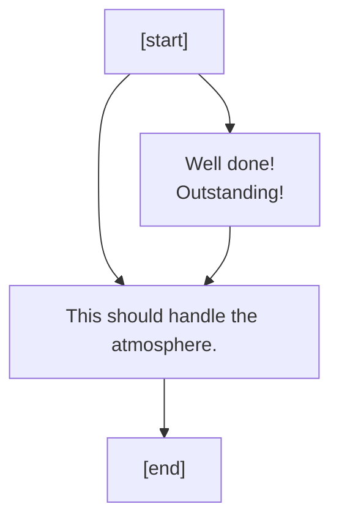

## Build and Power First Geological Center

## Build and Power Last Geological Center

## Build and Power Penultimate Geological Center

## Build and Power First Support Station

## Build and Power Last Support Station

## Build and Power Penultimate Support Station

