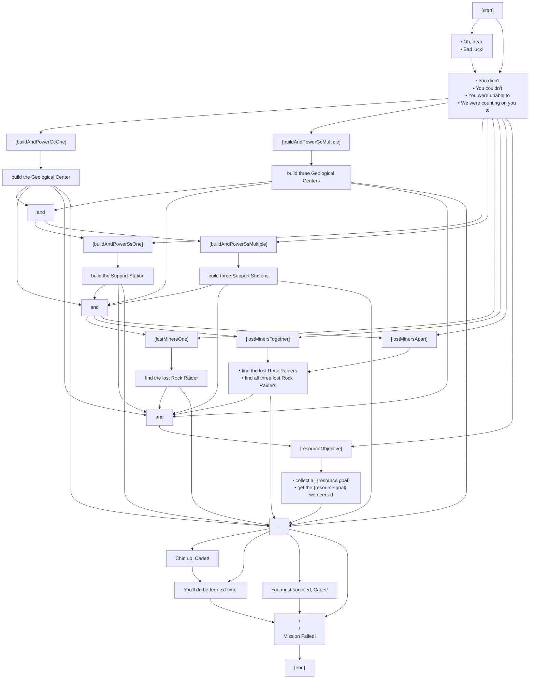
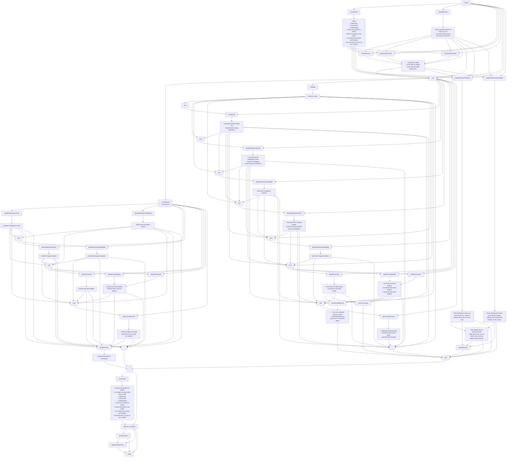

## Conclusion - Mission Failed

```mermaid
flowchart TD;
P0["[start]"]
P0 --> P1
P0 --> P2
P1["&bull; Oh, dear.<br/>&bull; Bad luck!"]
P1 --> P2
P2["&bull; You didn't<br/>&bull; You couldn't<br/>&bull; You were unable to<br/>&bull; We were counting on you to"]
P2 --> P3
P2 --> P5
P2 --> P8
P2 --> P10
P2 --> P13
P2 --> P15
P2 --> P16
P2 --> P19
P3["[buildAndPowerGcOne]"]
P3 --> P4
P4["build the Geological Center"]
P4 --> P7
P4 --> P12
P4 --> P18
P4 --> P21
P5["[buildAndPowerGcMultiple]"]
P5 --> P6
P6["build three Geological Centers"]
P6 --> P7
P6 --> P12
P6 --> P18
P6 --> P21
P7["and"]
P7 --> P8
P7 --> P10
P8["[buildAndPowerSsOne]"]
P8 --> P9
P9["build the Support Station"]
P9 --> P12
P9 --> P18
P9 --> P21
P10["[buildAndPowerSsMultiple]"]
P10 --> P11
P11["build three Support Stations"]
P11 --> P12
P11 --> P18
P11 --> P21
P12["and"]
P12 --> P13
P12 --> P15
P12 --> P16
P13["[lostMinersOne]"]
P13 --> P14
P14["find the lost Rock Raider"]
P14 --> P18
P14 --> P21
P15["[lostMinersTogether]"]
P15 --> P17
P16["[lostMinersApart]"]
P16 --> P17
P17["&bull; find the lost Rock Raiders<br/>&bull; find all three lost Rock Raiders"]
P17 --> P18
P17 --> P21
P18["and"]
P18 --> P19
P19["[resourceObjective]"]
P19 --> P20
P20["&bull; collect all {resource goal}<br/>&bull; get the {resource goal} we needed"]
P20 --> P21
P21["."]
P21 --> P22
P21 --> P23
P21 --> P24
P21 --> P25
P22["Chin up, Cadet!"]
P22 --> P23
P23["You'll do better next time."]
P23 --> P25
P24["You must succeed, Cadet!"]
P24 --> P25
P25["\\n\\nMission Failed!"]
P25 --> P26
P26["[end]"]
```

## Conclusion - Success

```mermaid
flowchart TD;
P0["[start]"]
P0 --> P1
P0 --> P3
P0 --> P5
P0 --> P6
P0 --> P7
P0 --> P9
P0 --> P61
P0 --> P63
P1["[commend]"]
P1 --> P2
P2["&bull; Wow!<br/>&bull; Well done!<br/>&bull; Good work!<br/>&bull; Outstanding!<br/>&bull; I knew you could do it, Cadet!<br/>&bull; You're very good at this, Cadet!<br/>&bull; Your efforts have been outstanding!<br/>&bull; We were right to count on you, Cadet!"]
P2 --> P5
P2 --> P6
P2 --> P7
P2 --> P9
P2 --> P61
P2 --> P63
P3["[hasMonsters]"]
P3 --> P4
P4["&bull; Those {enemies} were no match for you!<br/>&bull; You had nothing to fear from those {enemies}!"]
P4 --> P5
P4 --> P6
P4 --> P7
P4 --> P8
P4 --> P9
P4 --> P61
P4 --> P63
P5["[hasMonsters]"]
P5 --> P8
P6["[spawnHasErosion]"]
P6 --> P8
P7["[anchorIsGasLeak]"]
P7 --> P8
P8["&bull; Despite the odds,<br/>&bull; In the face of danger,<br/>&bull; Even with the odds against you,"]
P8 --> P9
P8 --> P61
P8 --> P63
P9["you"]
P9 --> P10
P9 --> P31
P9 --> P34
P9 --> P37
P9 --> P40
P9 --> P43
P9 --> P46
P9 --> P49
P9 --> P51
P9 --> P52
P9 --> P58
P10["&bull; managed to<br/>&bull; were able to"]
P10 --> P11
P10 --> P13
P10 --> P16
P10 --> P18
P10 --> P21
P10 --> P23
P10 --> P24
P10 --> P27
P11["[buildAndPowerGcOne]"]
P11 --> P12
P12["build the Geological Center"]
P12 --> P15
P12 --> P20
P12 --> P26
P12 --> P29
P12 --> P68
P13["[buildAndPowerGcMultiple]"]
P13 --> P14
P14["build three Geological Centers"]
P14 --> P15
P14 --> P20
P14 --> P26
P14 --> P29
P14 --> P68
P15["and"]
P15 --> P16
P15 --> P18
P16["[buildAndPowerSsOne]"]
P16 --> P17
P17["build the Support Station"]
P17 --> P20
P17 --> P26
P17 --> P29
P17 --> P68
P18["[buildAndPowerSsMultiple]"]
P18 --> P19
P19["build three Support Stations"]
P19 --> P20
P19 --> P26
P19 --> P29
P19 --> P68
P20["and"]
P20 --> P21
P20 --> P23
P20 --> P24
P21["[lostMinersOne]"]
P21 --> P22
P22["find the lost Rock Raider"]
P22 --> P26
P22 --> P29
P22 --> P68
P23["[lostMinersTogether]"]
P23 --> P25
P24["[lostMinersApart]"]
P24 --> P25
P25["&bull; find the lost Rock Raiders<br/>&bull; find all three lost Rock Raiders"]
P25 --> P26
P25 --> P29
P25 --> P68
P26["and"]
P26 --> P27
P27["[resourceObjective]"]
P27 --> P28
P28["&bull; collect all {resource goal}<br/>&bull; get the {resource goal} we needed"]
P28 --> P29
P28 --> P68
P29["[hasMonsters]"]
P29 --> P30
P30["despite that horde of {enemies}!"]
P30 --> P69
P31["[findHq]"]
P31 --> P32
P32["found the base"]
P32 --> P33
P32 --> P36
P32 --> P39
P32 --> P42
P32 --> P45
P32 --> P48
P32 --> P57
P32 --> P60
P33["and"]
P33 --> P34
P34["[hqIsRuin]"]
P34 --> P35
P35["&bull; repaired the Rock Raider HQ<br/>&bull; restored our mining operations"]
P35 --> P36
P35 --> P39
P35 --> P42
P35 --> P45
P35 --> P48
P35 --> P57
P35 --> P60
P36["and"]
P36 --> P37
P37["[buildAndPowerGcOne]"]
P37 --> P38
P38["&bull; constructed the Geological Center<br/>&bull; built the Geological Center where we needed it"]
P38 --> P39
P38 --> P42
P38 --> P45
P38 --> P48
P38 --> P57
P38 --> P60
P39["and"]
P39 --> P40
P40["[buildAndPowerGcMultiple]"]
P40 --> P41
P41["built three Geological Centers"]
P41 --> P42
P41 --> P45
P41 --> P48
P41 --> P57
P41 --> P60
P42["and"]
P42 --> P43
P43["[buildAndPowerSsOne]"]
P43 --> P44
P44["&bull; constructed the Support Station<br/>&bull; built the Support Station where we needed it"]
P44 --> P45
P44 --> P48
P44 --> P57
P44 --> P60
P45["and"]
P45 --> P46
P46["[buildAndPowerSsMultiple]"]
P46 --> P47
P47["built three Support Stations"]
P47 --> P48
P47 --> P57
P47 --> P60
P48["and"]
P48 --> P49
P48 --> P51
P48 --> P52
P49["[lostMinersOne]"]
P49 --> P50
P50["&bull; found the lost Rock Raider<br/>&bull; located the lost Rock Raider"]
P50 --> P54
P50 --> P56
P50 --> P57
P50 --> P60
P51["[lostMinersTogether]"]
P51 --> P53
P52["[lostMinersApart]"]
P52 --> P53
P53["&bull; found the lost Rock Raiders<br/>&bull; located the lost Rock Raiders<br/>&bull; found all three Rock Raiders"]
P53 --> P54
P53 --> P56
P53 --> P57
P53 --> P60
P54["[resourceObjective]"]
P54 --> P55
P55["&bull; . You even collected {resource goal}!<br/>&bull; . Collecting {resource goal} was no small feat either!"]
P55 --> P67
P56[", safe and sound."]
P56 --> P67
P57["and"]
P57 --> P58
P58["[resourceObjective]"]
P58 --> P59
P59["&bull; collected {resource goal}<br/>&bull; collected all {resource goal}<br/>&bull; got all {resource goal}"]
P59 --> P60
P60["."]
P60 --> P67
P61["[buildAndPowerGcOne]"]
P61 --> P62
P62["That Geological Center you built will be very useful to decide where we can mine next."]
P62 --> P65
P62 --> P66
P62 --> P67
P63["[buildAndPowerGcMultiple]"]
P63 --> P64
P64["Those Geological Centers you built are already helping us far beyond the reaches of this cavern."]
P64 --> P65
P64 --> P66
P64 --> P67
P65["&bull; We already have a promising lead!<br/>&bull; With these built, we can safely make our way further into the planet."]
P65 --> P66
P65 --> P67
P66["[hasMonsters]"]
P66 --> P67
P67 --> P69
P68["."]
P68 --> P69
P69["\\n\\n"]
P69 --> P70
P69 --> P72
P70["[commend]"]
P70 --> P71
P71["&bull; Keep up the good work, Cadet!<br/>&bull; You make this look rather easy, Cadet!<br/>&bull; Well done!<br/>&bull; Good work!<br/>&bull; Outstanding!<br/>&bull; I knew you could do it, Cadet!<br/>&bull; You're very good at this, Cadet!<br/>&bull; Your efforts have been outstanding!<br/>&bull; We were right to count on you, Cadet!"]
P71 --> P72
P72["Mission Complete!"]
P72 --> P73
P72 --> P74
P72 --> P75
P73["[hasMonsters]"]
P73 --> P74
P73 --> P75
P74["[spawnHasErosion]"]
P74 --> P75
P75["[end]"]
```
