## Blackout End

## Blackout Start

## Boss Enemy Defeated

## Base Destroyed - Mission Failure

## Found All Lost Miners

## Found Crystal Hoard

```mermaid
flowchart TD;
P0["[start]"]
P0 --> P1
P1["&bull; Wow! This ought to do it!<br/>&bull; You've found quite the haul here.<br/>&bull; Our intel was accurate. Look at all those Energy Crystals!"]
P1 --> P2
P1 --> P3
P1 --> P5
P2["&bull; Now, transport these Energy Crystals back to your base.<br/>&bull; Bring this to your base to complete our mission!<br/>&bull; Get this back to your base."]
P2 --> P7
P2 --> P8
P2 --> P9
P2 --> P10
P3["[treasureCaveMany]"]
P3 --> P4
P4["&bull; With this, we have enough to complete our mission!<br/>&bull; Collect all the Energy Crystals you've found and complete our mission!"]
P4 --> P7
P4 --> P8
P4 --> P9
P4 --> P10
P5["[hasMonsters]"]
P5 --> P6
P6["&bull; I hope we can collect these without attracting too much attention.<br/>&bull; Be careful, Cadet! This is surely enough to attract those {enemies}."]
P6 --> P7
P6 --> P8
P6 --> P9
P6 --> P10
P7["[treasureCaveOne]"]
P7 --> P9
P7 --> P10
P8["[treasureCaveMany]"]
P8 --> P9
P8 --> P10
P9["[hasMonsters]"]
P9 --> P10
P10["[end]"]
```

## Found HQ

## Found Vehicle left by Lost Miners

## Found Lost Miners

## Found Slimy Slug Nest

## Gas Leak - Support Stations Insufficient

## Gas Leak - All Support Stations offline

## Mob Farm no longer blocking

## Nomads have settled

