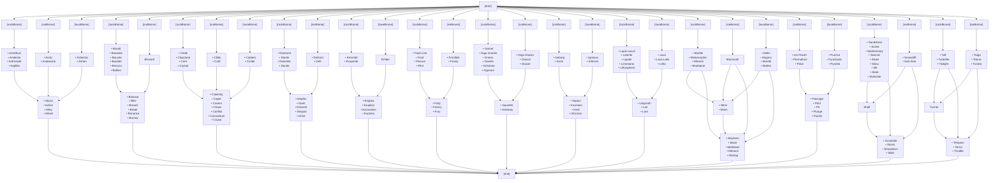

## Mission Name

```mermaid
flowchart TD;
P0["[start]"]
P0 --> P1
P0 --> P3
P0 --> P5
P0 --> P8
P0 --> P10
P0 --> P13
P0 --> P15
P0 --> P17
P0 --> P20
P0 --> P22
P0 --> P25
P0 --> P27
P0 --> P30
P0 --> P32
P0 --> P35
P0 --> P37
P0 --> P40
P0 --> P42
P0 --> P45
P0 --> P47
P0 --> P50
P0 --> P52
P0 --> P54
P0 --> P58
P0 --> P60
P0 --> P63
P0 --> P65
P0 --> P69
P0 --> P71
P1["[rockBiome]"]
P1 --> P2
P2["&bull; Amethyst<br/>&bull; Andesite<br/>&bull; Anthracite<br/>&bull; Argillite"]
P2 --> P7
P3["[iceBiome]"]
P3 --> P4
P4["&bull; Arctic<br/>&bull; Avalanche"]
P4 --> P7
P5["[lavaBiome]"]
P5 --> P6
P6["&bull; Asbestos<br/>&bull; Ashen"]
P6 --> P7
P7["&bull; Abyss<br/>&bull; Action<br/>&bull; Alley<br/>&bull; Attack"]
P7 --> P75
P8["[rockBiome]"]
P8 --> P9
P9["&bull; Basalt<br/>&bull; Basanite<br/>&bull; Bauxite<br/>&bull; Boulder<br/>&bull; Breccia<br/>&bull; Bullion"]
P9 --> P12
P10["[iceBiome]"]
P10 --> P11
P11["Blizzard"]
P11 --> P12
P12["&bull; Balance<br/>&bull; Blitz<br/>&bull; Breach<br/>&bull; Break<br/>&bull; Bonanza<br/>&bull; Burrow"]
P12 --> P75
P13["[rockBiome]"]
P13 --> P14
P14["&bull; Chalk<br/>&bull; Claystone<br/>&bull; Core<br/>&bull; Crystal"]
P14 --> P19
P15["[iceBiome]"]
P15 --> P16
P16["&bull; Chilly<br/>&bull; Cold"]
P16 --> P19
P17["[lavaBiome]"]
P17 --> P18
P18["&bull; Caldera<br/>&bull; Cinder"]
P18 --> P19
P19["&bull; Calamity<br/>&bull; Caper<br/>&bull; Cavern<br/>&bull; Chaos<br/>&bull; Conflict<br/>&bull; Conundrum<br/>&bull; Cruise"]
P19 --> P75
P20["[rockBiome]"]
P20 --> P21
P21["&bull; Diamond<br/>&bull; Diorite<br/>&bull; Dolomite<br/>&bull; Dunite"]
P21 --> P24
P22["[iceBiome]"]
P22 --> P23
P23["&bull; Dichoric<br/>&bull; Drift"]
P23 --> P24
P24["&bull; Depths<br/>&bull; Dash<br/>&bull; Descent<br/>&bull; Despair<br/>&bull; Drive"]
P24 --> P75
P25["[rockBiome]"]
P25 --> P26
P26["&bull; Emerald<br/>&bull; Evaporite"]
P26 --> P29
P27["[lavaBiome]"]
P27 --> P28
P28["Ember"]
P28 --> P29
P29["&bull; Enigma<br/>&bull; Eruption<br/>&bull; Excavation<br/>&bull; Express"]
P29 --> P75
P30["[rockBiome]"]
P30 --> P31
P31["&bull; Fault Line<br/>&bull; Final<br/>&bull; Fissure<br/>&bull; Flint"]
P31 --> P34
P32["[iceBiome]"]
P32 --> P33
P33["&bull; Frostbite<br/>&bull; Frosty"]
P33 --> P34
P34["&bull; Folly<br/>&bull; Frenzy<br/>&bull; Fury"]
P34 --> P75
P35["[rockBiome]"]
P35 --> P36
P36["&bull; Garnet<br/>&bull; Giga Granite<br/>&bull; Gneiss<br/>&bull; Granite<br/>&bull; Gritstone<br/>&bull; Gypsum"]
P36 --> P39
P37["[iceBiome]"]
P37 --> P38
P38["&bull; Giga Glacier<br/>&bull; Glacial<br/>&bull; Glacier"]
P38 --> P39
P39["&bull; Gauntlet<br/>&bull; Getaway"]
P39 --> P75
P40["[iceBiome]"]
P40 --> P41
P41["&bull; Iceberg<br/>&bull; Icicle"]
P41 --> P44
P42["[lavaBiome]"]
P42 --> P43
P43["&bull; Igneous<br/>&bull; Infernal"]
P43 --> P44
P44["&bull; Impact<br/>&bull; Incursion<br/>&bull; Inset<br/>&bull; Intrusion"]
P44 --> P75
P45["[rockBiome]"]
P45 --> P46
P46["&bull; Lapis Lazuli<br/>&bull; Laterite<br/>&bull; Lignite<br/>&bull; Limestone<br/>&bull; Lithosphere"]
P46 --> P49
P47["[lavaBiome]"]
P47 --> P48
P48["&bull; Lava<br/>&bull; Lava Lake<br/>&bull; Lithic"]
P48 --> P49
P49["&bull; Labyrinth<br/>&bull; Lair<br/>&bull; Lure"]
P49 --> P75
P50["[rockBiome]"]
P50 --> P51
P51["&bull; Marble<br/>&bull; Metamorphic<br/>&bull; Mineral<br/>&bull; Mudstone"]
P51 --> P56
P51 --> P57
P52["[iceBiome]"]
P52 --> P53
P53["Mammoth"]
P53 --> P56
P53 --> P57
P54["[lavaBiome]"]
P54 --> P55
P55["&bull; Mafic<br/>&bull; Magma<br/>&bull; Mantle<br/>&bull; Molten"]
P55 --> P56
P55 --> P57
P56["&bull; Mine<br/>&bull; Moon"]
P56 --> P57
P57["&bull; Mayhem<br/>&bull; Maze<br/>&bull; Meltdown<br/>&bull; Menace<br/>&bull; Mishap"]
P57 --> P75
P58["[iceBiome]"]
P58 --> P59
P59["&bull; Ice Planet<br/>&bull; Permafrost<br/>&bull; Polar"]
P59 --> P62
P60["[lavaBiome]"]
P60 --> P61
P61["&bull; Pumice<br/>&bull; Pyroclastic<br/>&bull; Pyrolite"]
P61 --> P62
P62["&bull; Passage<br/>&bull; Peril<br/>&bull; Pit<br/>&bull; Plunge<br/>&bull; Puzzle"]
P62 --> P75
P63["[rockBiome]"]
P63 --> P64
P64["&bull; Sandstone<br/>&bull; Schist<br/>&bull; Sedimentary<br/>&bull; Seismic<br/>&bull; Shale<br/>&bull; Silica<br/>&bull; Silt<br/>&bull; Slate<br/>&bull; Stalactite"]
P64 --> P67
P64 --> P68
P65["[iceBiome]"]
P65 --> P66
P66["&bull; Snowdrift<br/>&bull; Sub-Zero"]
P66 --> P67
P66 --> P68
P67["Shaft"]
P67 --> P68
P68["&bull; Scramble<br/>&bull; Shock<br/>&bull; Showdown<br/>&bull; Slide"]
P68 --> P75
P69["[rockBiome]"]
P69 --> P70
P70["&bull; Tuff<br/>&bull; Turbidite<br/>&bull; Twilight"]
P70 --> P73
P70 --> P74
P71["[iceBiome]"]
P71 --> P72
P72["&bull; Taiga<br/>&bull; Titanic<br/>&bull; Tundra"]
P72 --> P73
P72 --> P74
P73["Tunnel"]
P73 --> P74
P74["&bull; Tempest<br/>&bull; Terror<br/>&bull; Trouble"]
P74 --> P75
P75["[end]"]
```
