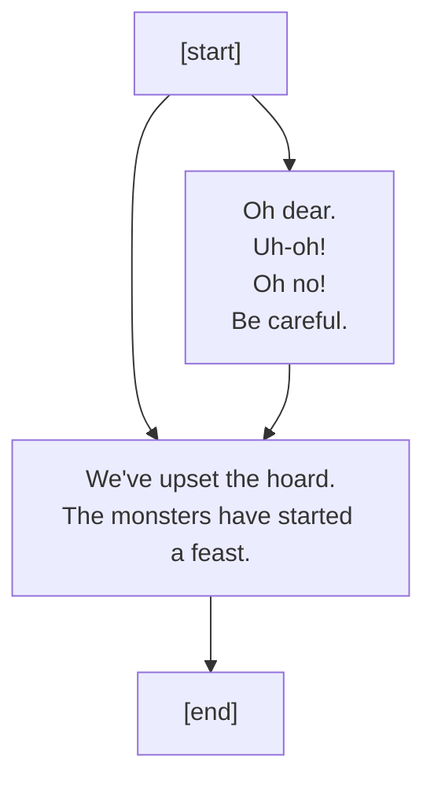
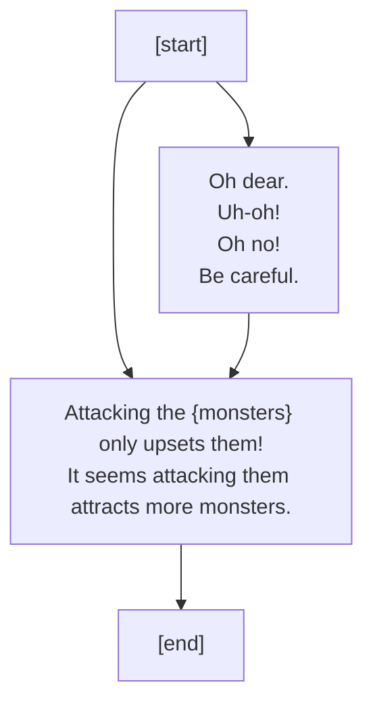
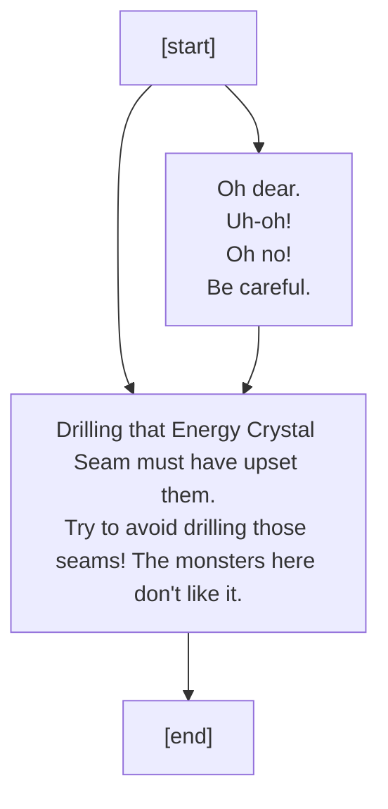
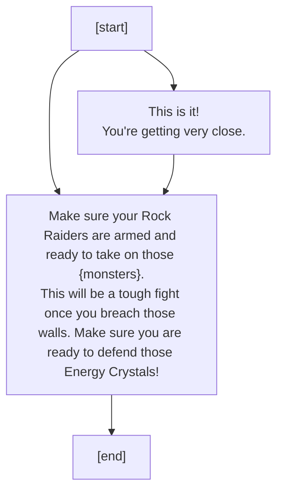

## Pandora - Did spawn hoard

```mermaid
flowchart TD;
P0["[start]"]
P0 --> P1
P0 --> P2
P1["Oh dear.<br/>Uh-oh!<br/>Oh no!<br/>Be careful."]
P1 --> P2
P2["We've upset the hoard.<br/>The monsters have started a feast. "]
P2 --> P3
P3["[end]"]
```

## Pandora - Did spawn rogue monster

```mermaid
flowchart TD;
P0["[start]"]
P0 --> P1
P0 --> P2
P1["Oh dear.<br/>Uh-oh!<br/>Oh no!<br/>Be careful."]
P1 --> P2
P2["Attacking the {monsters} only upsets them!<br/>It seems attacking them attracts more monsters."]
P2 --> P3
P3["[end]"]
```

## Pandora - Did spawn monster from seam

```mermaid
flowchart TD;
P0["[start]"]
P0 --> P1
P0 --> P2
P1["Oh dear.<br/>Uh-oh!<br/>Oh no!<br/>Be careful."]
P1 --> P2
P2["Drilling that Energy Crystal Seam must have upset them.<br/>Try to avoid drilling those seams! The monsters here don't like it."]
P2 --> P3
P3["[end]"]
```

## Pandora - Approaching hoard

```mermaid
flowchart TD;
P0["[start]"]
P0 --> P1
P0 --> P2
P1["This is it!<br/>You're getting very close."]
P1 --> P2
P2["Make sure your Rock Raiders are armed and ready to take on those {monsters}.<br/>This will be a tough fight once you breach those walls. Make sure you are ready to defend those Energy Crystals!"]
P2 --> P3
P3["[end]"]
```