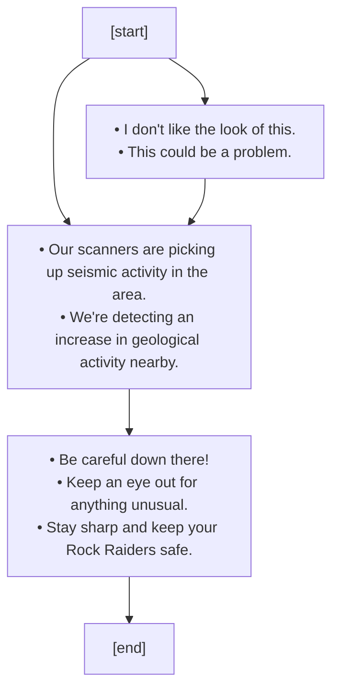
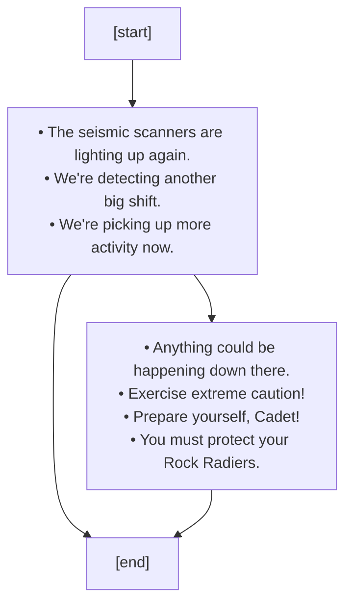

## Foreshadow Seismic Event

```mermaid
flowchart TD;
P0["[start]"]
P0 --> P1
P0 --> P2
P1["&bull; I don't like the look of this.<br/>&bull; This could be a problem."]
P1 --> P2
P2["&bull; Our scanners are picking up seismic activity in the area.<br/>&bull; We're detecting an increase in geological activity nearby."]
P2 --> P3
P3["&bull; Be careful down there!<br/>&bull; Keep an eye out for anything unusual.<br/>&bull; Stay sharp and keep your Rock Raiders safe."]
P3 --> P4
P4["[end]"]
```

## Foreshadow Seismic Event (Again)

```mermaid
flowchart TD;
P0["[start]"]
P0 --> P1
P1["&bull; The seismic scanners are lighting up again.<br/>&bull; We're detecting another big shift.<br/>&bull; We're picking up more activity now."]
P1 --> P2
P1 --> P3
P2["&bull; Anything could be happening down there.<br/>&bull; Exercise extreme caution!<br/>&bull; Prepare yourself, Cadet!<br/>&bull; You must protect your Rock Radiers."]
P2 --> P3
P3["[end]"]
```
